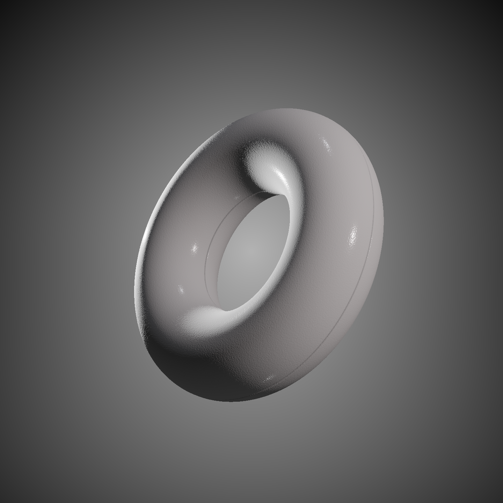
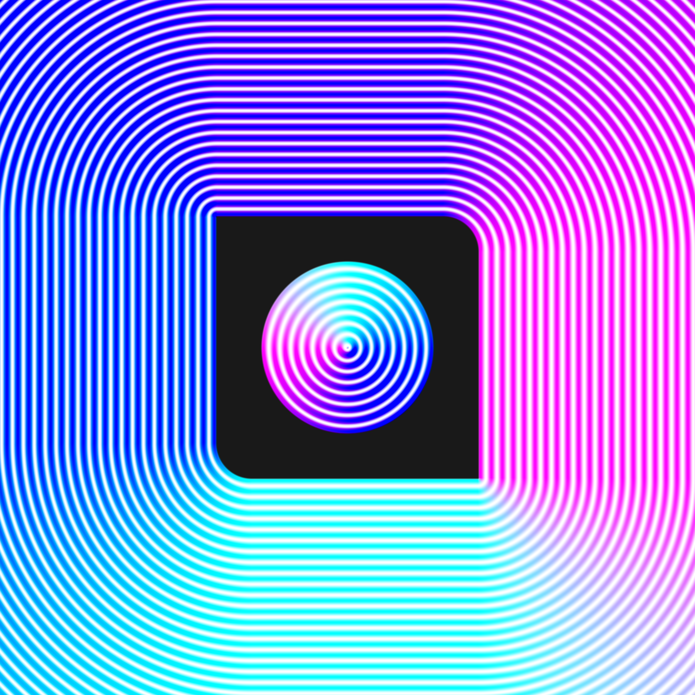

# Creating a basic ray marcher using WebGPU

This is a very simple setup to render a WebGPU fragment shader to a canvas element. This was created for experimentation with WebGPU/wgsl and ray marching. The goal of this is to get a nice looking PBR renderer for SDFs.

---
### Sample Images

|Ray Marching|2D SDFs|
|-|-|
|||


---
## References & info:


- WebGPU setup based primarily off of:
https://codelabs.developers.google.com/your-first-webgpu-app#1

- [Inigo Quilez - Ray Marching SDFs](https://iquilezles.org/articles/raymarchingdf/  )
- [Inigo Quilez - Distance Functions](https://iquilezles.org/articles/distfunctions/)
- [SimonDev - Ray Marching](https://www.youtube.com/watch?v=BNZtUB7yhX4&t=146s)
- [The Art of Code - Ray Marching](https://www.youtube.com/watch?v=PGtv-dBi2wE&t=733s)


## Handy notes for WGSL:
- "let" keyword -> immutable, "var" keyword -> mutable
    ```wgsl
    let a = 0.0; // immutable
    var b = 0.0; // mutable
    ```
- Arrays (fixed size):
    ```
    const arr = array<f32, 4>(1., 2., 3., 4.);
    ```
    **Runtime sized arrays require buffers*
- wgsl doesn't support ternary condiional conditionals, instead provides select()
  ```
    float a = (<condition>) ? <true value> : <false value>; // glsl
    let a = select(<false value>, <true value>, <condition>); //wgsl
  ```
- Function parameters are immutable
- For loops are quite different:
  ```
  //GLSL
  int a = 2;
    for (int i = 0; i < 4; i++) {
    a *= 2;
  }

  //WGSL
  var a: i32 = 2;
  var i: i32 = 0;      // <1>
  loop {
    if i >= 4 { break; }
    a = a * 2;
    i++;
  }
  ```
